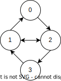
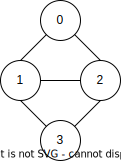

# Алгоритмы (семинары) <!-- omit in toc -->

- [Графы](#графы)
  - [Виды графов:](#виды-графов)
  - [Способы записи:](#способы-записи)
  - [Алгоритмы обхода графа](#алгоритмы-обхода-графа)
    - [DFS](#dfs)
    - [BFS](#bfs)
  - [Топологическая сортировка */дописать/*](#топологическая-сортировка-дописать)


## Графы

### Виды графов: 

- Связаный/не связанный
- Взвешенный/не взвешенный

### Способы записи:



- Матрица смежности
  |   | 0 | 1 | 2 | 3 |
  | - | - | - | - | - |
  | 0 | 0 | 0 | 1 | 0 |
  | 1 | 1 | 0 | 1 | 0 |
  | 2 | 0 | 1 | 0 | 1 |
  | 3 | 0 | 1 | 0 | 0 |
  - \- много памяти
- Список смежности: [(0, 2), (1, 0), (1, 2), (2, 1), (2, 3), (3, 1)]
  - \+ мало памяти
  - \- сложно искать ребра
- Списки смежности: {0: [2], 1: [0, 2], 2: [1, 2], 3: [1]} - *лучший вариант*
  - \+ мало памяти
  - \+ просто искать элементы
  - **Возможные реализации**: `std::map<int, std::vector<int>>`, `std::vector<std::vector<int>>`, `node` структура

### Алгоритмы обхода графа

#### DFS



```c++
vector < vector<int> > g; // граф
int n; // число вершин

vector<int> color; // цвет вершины (0, 1, или 2)

vector<int> time_in, time_out; // "времена" захода и выхода из вершины
int dfs_timer = 0; // "таймер" для определения времён

void dfs (int v) {
	time_in[v] = dfs_timer++;
	color[v] = 1;
	for (vector<int>::iterator i=g[v].begin(); i!=g[v].end(); ++i)
		if (color[*i] == 0)
			dfs (*i);
	color[v] = 2;
	time_out[v] = dfs_timer++;
}
```

#### BFS

```c++ 
queue<int> q;
q.push (s);
vector<bool> used (n);
vector<int> d (n), p (n);
used[s] = true;
p[s] = -1;
while (!q.empty()) {
	int v = q.front();
	q.pop();
	for (size_t i=0; i<g[v].size(); ++i) {
		int to = g[v][i];
		if (!used[to]) {
			used[to] = true;
			q.push (to);
			d[to] = d[v] + 1;
			p[to] = v;
		}
	}
}
```

### Топологическая сортировка */дописать/*

**Задача:**

Есть несколько пакетов, некоторые зависят от других. Нужно установить последовательность, в которой нужно установить пакеты.

