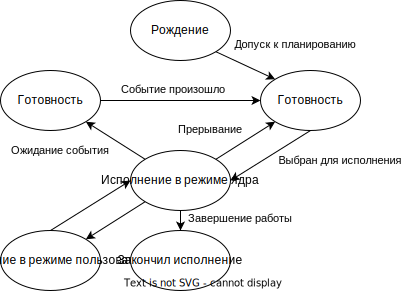
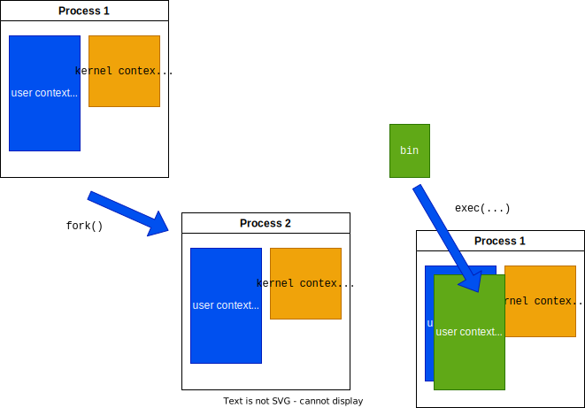

# Архитектура компьютеров и операционные системы (лекции) <!-- omit in toc -->

- [Исторический экскурс в операционные системы](#исторический-экскурс-в-операционные-системы)
- [Оболочка](#оболочка)
  - [Что это такое:](#что-это-такое)
- [Системные вызовы](#системные-вызовы)
- [Систаксис команд Unix](#систаксис-команд-unix)
  - [Команда и аргументы](#команда-и-аргументы)
  - [Перенаправление ввода-вывода](#перенаправление-ввода-вывода)
  - [Подстановки в оболочке (shell expansions)](#подстановки-в-оболочке-shell-expansions)
- [Процессы в Unix](#процессы-в-unix)
  - [Контекст процесса](#контекст-процесса)
  - [Иерарзия процессов](#иерарзия-процессов)
  - [Команды управления процессами в Linux](#команды-управления-процессами-в-linux)
  - [Диаграмма состояний процессора](#диаграмма-состояний-процессора)
  - [Планирование](#планирование)
  - [Системный вызов для PID](#системный-вызов-для-pid)
  - [Создание процесса в Unix](#создание-процесса-в-unix)
  - [Системный вызов создания процесса](#системный-вызов-создания-процесса)
  - [Использование fork()](#использование-fork)
  - [Завершение процесса](#завершение-процесса)
  - [Процесс в представлении С](#процесс-в-представлении-с)
  - [Изменение контекста процесса](#изменение-контекста-процесса)
  - [Использование exec()](#использование-exec)
- [Потоки ввода-вывода](#потоки-ввода-вывода)
  - [С-функции для работы с файлами](#с-функции-для-работы-с-файлами)
  - [Файловый дескриптор](#файловый-дескриптор)
- [Лекция 5. Средства IPC. Разделяемая память](#лекция-5-средства-ipc-разделяемая-память)
  - [Недостатки потокового обмена данными между процессами](#недостатки-потокового-обмена-данными-между-процессами)
  - [System V IPC](#system-v-ipc)
  - [Пространство имён](#пространство-имён)
  - [Пространство имён System V IPC](#пространство-имён-system-v-ipc)
  - [Генерация ключа SysV IPC](#генерация-ключа-sysv-ipc)
  - [Дескрипторы System V IPC](#дескрипторы-system-v-ipc)
  - [Страничная орзанизация памяти](#страничная-орзанизация-памяти)
  - [Совместно используемая память (shared memory)](#совместно-используемая-память-shared-memory)
  - [Поключение сегмента памяти](#поключение-сегмента-памяти)
  - [Отключение сегмента памяти](#отключение-сегмента-памяти)
  - [Удаление совместной используемой памяти](#удаление-совместной-используемой-памяти)
  - [Консольныые команды SysV IPC](#консольныые-команды-sysv-ipc)
- [Лекция 6. Нити исполнения. Средства IPC: Семафоры](#лекция-6-нити-исполнения-средства-ipc-семафоры)
  - [Нити исполнения / потоки выполнения / threads](#нити-исполнения--потоки-выполнения--threads)
  - [Реализации потоков выполнения](#реализации-потоков-выполнения)
  - [Стандарт POSIX для потоков выполнения - pthreads](#стандарт-posix-для-потоков-выполнения---pthreads)
  - [Создание потока выполнения](#создание-потока-выполнения)
  - [Завершение потока ожидания](#завершение-потока-ожидания)
  - [Ожидание потока вывода](#ожидание-потока-вывода)
  - [Особенности доступа к совместно используемой памяти](#особенности-доступа-к-совместно-используемой-памяти)
  - [Синхронизация с помощью семафоров (semaphores)](#синхронизация-с-помощью-семафоров-semaphores)
  - [Семафоры System V IPC](#семафоры-system-v-ipc)
  - [Получение доступа / создание семафоров SysV IPC](#получение-доступа--создание-семафоров-sysv-ipc)
  - [Операции над семафором SysV IPC](#операции-над-семафором-sysv-ipc)
- [Лекция 7. Очереди сообщений](#лекция-7-очереди-сообщений)
  - [Модель сообщений для взаимодействия процессов](#модель-сообщений-для-взаимодействия-процессов)
  - [Очереди сообщений System V IPC message queues](#очереди-сообщений-system-v-ipc-message-queues)
  - [Консольная команда для очередей сообщений Sys V IPC](#консольная-команда-для-очередей-сообщений-sys-v-ipc)
  - [Получение доступа/создание очереди сообщений SysV IPC](#получение-доступасоздание-очереди-сообщений-sysv-ipc)
  - [Отправка сообщения в SysV IPC](#отправка-сообщения-в-sysv-ipc)
  - [Шаблон сообщения SysV IPC](#шаблон-сообщения-sysv-ipc)
  - [Примеры сообщений SysV IPC](#примеры-сообщений-sysv-ipc)
  - [Получение сообщения SysV IPC](#получение-сообщения-sysv-ipc)
  - [Удаление очереди сообщений SysV IPC](#удаление-очереди-сообщений-sysv-ipc)
- [Файловая система Unix](#файловая-система-unix)
  - [Логические разделы физического носителя информации](#логические-разделы-физического-носителя-информации)
  - [Необходимость partitions](#необходимость-partitions)
  - [Структура файловой системы](#структура-файловой-системы)
  - [Типы файловых систем](#типы-файловых-систем)
  - [Файловая система s5fs](#файловая-система-s5fs)
  - [Организация каталогов](#организация-каталогов)
  - [Чтение содержимого каталога:](#чтение-содержимого-каталога)
  - [Создание жесткой связи](#создание-жесткой-связи)
  - [Создание мягкой связи](#создание-мягкой-связи)
- [Файловая система (продолжение)](#файловая-система-продолжение)
  - [Данные об открытых файлах в ОС](#данные-об-открытых-файлах-в-ос)
  - [Системные вызовы для выполнения операций над файлами:](#системные-вызовы-для-выполнения-операций-над-файлами)
  - [Создание файла](#создание-файла)
  - [Изменение размера файла](#изменение-размера-файла)
  - [Изменение текущей позиции](#изменение-текущей-позиции)
  - [Файлы, отображаемые в память](#файлы-отображаемые-в-память)
  - [Виртуальная память](#виртуальная-память)
  - [Работа с memory-mapped файлами](#работа-с-memory-mapped-файлами)
  - [Отображение файла в памяти](#отображение-файла-в-памяти)
  - [Закрытие отображения файла](#закрытие-отображения-файла)
  - [Пример](#пример)
- [Прерывания, сигналы](#прерывания-сигналы)
  - [Идея механизма прерываний (interrupt)](#идея-механизма-прерываний-interrupt)
  - [Механизм исключений (exception)](#механизм-исключений-exception)
  - [Механизм программных прерываний (trap, software interrupt)](#механизм-программных-прерываний-trap-software-interrupt)
  - [Обработка прерываний и исключений - идея сигналов](#обработка-прерываний-и-исключений---идея-сигналов)
  - [Типы сигналов](#типы-сигналов)
  - [Реакция процесса на сигнал](#реакция-процесса-на-сигнал)
  - [Иерархия процессов ОС](#иерархия-процессов-ос)
  - [Номер группы процессов (вариант 1)](#номер-группы-процессов-вариант-1)
  - [Номер сеанса](#номер-сеанса)
  - [Управляющий терминал](#управляющий-терминал)
  - [Лидер сеанса](#лидер-сеанса)
  - [Отправка сигналов процессам](#отправка-сигналов-процессам)
- [Введение в сетевое программирование в UNIX. Часть 1/4](#введение-в-сетевое-программирование-в-unix-часть-14)
  - [Зачем объединять компьютеры в сети](#зачем-объединять-компьютеры-в-сети)
  - [Сетевые и распределённые операционные системы](#сетевые-и-распределённые-операционные-системы)
  - [Работа сети = взаимодействие удалённых процессов](#работа-сети--взаимодействие-удалённых-процессов)
  - [Понятие протокола](#понятие-протокола)
  - [Задачи протокола](#задачи-протокола)
  - [Многоуровневая модель построения сетевых вычислительных систем](#многоуровневая-модель-построения-сетевых-вычислительных-систем)
  - [Уровни модели OSI/ISO](#уровни-модели-osiiso)
  - [История TCP/IP](#история-tcpip)
  - [Структура TCP/IP](#структура-tcpip)
  - [Взаимодействие клиента и сервера для протокола UDP](#взаимодействие-клиента-и-сервера-для-протокола-udp)
  - [Создание сокета](#создание-сокета)
  - [Привязка сокета к адресу](#привязка-сокета-к-адресу)

## Исторический экскурс в операционные системы

Операционная система - `Unix-подобная`

Мы будем говорить про многозадачность, многопользовательность, файловую систему, сетевые системы, виртуальная память, распараллеливание, ввод-вывод.

Изучаем с использованием языка `С`. 

Книги:
  + Основы операционных систем. Карпов, Коньков

**MultICS** - Multiplexed Information and Computing Service.

С 1964 по 1969 год **Multics** пытались разработать операционные системы. Этим занимались Bell Labs, MIT, General Electric.

В 1969 **AT&T** создают систему **UniCS**. Потом **CS** перешла в **X** и получилась **Unix**. Её разрабатывали Кен Томпсон, Деннис Ритчи и другими. В 1969 году появилась система **Unix Edition. 1**. В 1973 появился язык Си. В 1974 году вся система была переписана на Си.

1975 год - **Unix Edition 5 (Unix System V)**.

1978 год - **Unix Edition 7**.

## Оболочка

### Что это такое:

- Командный интерпретатор
- Текстовый интерфейс командной строки
- Запуск программ, выполняющих полезные действия
- Автоматизация действий в виде программ

## Системные вызовы

- Прямые точки входа пользовательских процессов в ядро  
- Выполняются в привилегированном режиме для доступа к системным данным/устройствам
- Реализованы по разному в различных ядрах
- Отображаются в вызовы функций языка `С` -> интерфейс системных вызовов -> стандартная UNIX-библиотека `libc`
- Стандарт POSIX - **P**ortable **O**perating **S**ystem **I**nterface

От библиотеки `libc` зависят все программы, выполняющиеся в Linux 

```c
#include <unistd.h> // <- int getuid()
#include <stdio.h> // <- void perror(char *)

int main() {
    int ret = getuid();
    perror("getuid result");
    return ret;
}
```

- Возвращаем значение 
  - `-1` - ошибка
  - `>= 0` - успех
- Точный код ошибка - в глобальной переменной `errno`
- При успешном завершении errno не меняется
- Расщифровка последнего кода ошибки - функция `perror(char *)` - выводит расшифровку по коду ошибки из глобальной переменной `errno` (перед этим подставляет `char *`)

## Систаксис команд Unix

### Команда и аргументы

`command arg1 arg2 ... argN`

1. **Аргументы, как опции**
  - Короткий формат:
    + `-a`
    + `-A`
    + `-bc`
  - Длинный формат:
    + `--help`
    + `--verbose`
2. **Типичное описание в документации**

`command [arg1] [arg2] arg3`

- `arg1` - необязательный аргумент `arg1`
- `arg3` - обязательный аргумент `arg3`

Короткие опции можно соединять в несколько, например не `-l -a`, а `-la`, стандарт для опций не существует.

Практически во всех командах существует опция `--help`

`man` - Manual

### Перенаправление ввода-вывода

**Вывод в файл:**
`cmd1 -a -b > out_file`
`cmd1 -c -d >> out_file`

**Считывание из файла:**
`cmd1 -e -f < in_file`

**Конвейер:**
`cmd1 -g -h | cmd2`

### Подстановки в оболочке (shell expansions)

В командной строке оболочка заменяет конструкции со спецсимволами **\***, **?**, **$**, **{}**, **[]**

1. `a*z`
   - заменяется на список имён файлов, имеющихся в текущем каталоге, соответствующих шаблону
   - подходят `az`, `abcz`, `a_z`, ...
   - `*` - любое количество любых символов
2. `a?z`
   - заменяется на список файлов имеющихся в текущем каталоге, соответствующих шаблону
   - подходят `abz`, `acz`
   - **не** подходят `az`, `abcz`
   - `?` - один любой символ
3. `a[b-d]z`
   - список файлов из текущего каталога по шаблону
   - `[]` - один любой символ из перечисленных
4. `a{bd, ed, gf}z`
   - генерирует список `abcz`, `adez`, `agfz`
   - безотносительно к файлам или текущему каталогу
5. `$var`
   - подставляет значение перменной по имени `var`
   - задать значение как `var=value` 

## Процессы в Unix

**Процесс** - программ + входные данные + момент исполнения

Процесс - совокупность:
- набора исполняющихся команд
- ассоциированных ресурсов (выделенная память, адресное пространство, стеки, файлы, устройства ввода-вывода и т. д.)
- текущего момента выполнения (значения регистров, программного счётчика, состояние стека, значения переменных и т. д.) под управлением операционной системы

Всё, что выполняется в Unix - процесс

### Контекст процесса

**Контекст** = пользовательский + ядерный

**Контекст ядра** = регистровый контекст + системный стек ядра + данные ядра

**Данные ядра (PCB Process Control Block):**
- идентификатор процесса PID
- идентификатор родительского процесса PPID
- идентификатор пользователя UID
- идентификатор группы GID

### Иерарзия процессов

- Каждый процесс порождается другим
- Создающий процесс - родитель (parent process)
- Сосздаваемый процесс - ребёнок, "дочерний процесс" (child process)
- Идентификатор процесса в Unix - **PID** - уникальное число $2^{31} - 1$

### Команды управления процессами в Linux

- `ps` - мгновенный ссписок процессов, запущенных текущими пользователем в текущем терминале
- `ps -eF` (`ps aux`) - мгновенный список всех процессов в системе в расширенном формате
- `top` - динамический список работающих процессов
- `htop` - динамический список процессов с интерфейсом

### Диаграмма состояний процессора



### Планирование

Планировщик процессов учитывает множество факторов: сколько процесс потреблял ресурсы, сколько времени работает и т. д.

### Системный вызов для PID

```c
#include <sys/types.h>
#include <unistd.h>

pid_t getpid(void);
pid_t getppid(void);
```

### Создание процесса в Unix

1. Скопировать весь контекст (copy-on-write)
2. Возможно настроить окружение
3. Заменить пользовательский контекст



### Системный вызов создания процесса 

```c
#include <sys/types.h>
#include <unistd.h>

pid_t fork();
```

### Использование fork()

```c
pid_t pid = fork();

if (pid > 0) {
  // родитель
} else if (pid == 0) {
  // ребенок
} else {
  // ошибка
}
```

После выхода из `fork()` продолжается исполнение следующего за вызовом кода (одинакового!), как в родителе, так и в ребёнке

Ветви исполнения кода в родителе и ребёнке можно разделить по возвращаемому значению

### Завершение процесса 

```c
#include <stdlib.h>

void exit(int status);
```

Нормальное завершение процесса - закрытие файлов, опустошение буферов, перевод в состояние "закончил исполнение"

Возврата в программу НЕТ

status - код завершения процесса, передается ОС
`0 - 255` - допустимые значения
`0` - успешное завершение

Если родитель завершается раньше ребенка: ребенок получает PPID = 1, т. е. родителем становится PID = 1 (головной процесс `init` или `systemd`)

Если родитель не запрашивает информацию о завершении: ребенок остаётся в состоянии "завершил исполнение" = процесс-зомби (zombie, defunct)

### Процесс в представлении С

```c
int main(
  int argc,
  char *argv[],
  char *envp[]
) {
  
  ... 
  
  return err_code;
}
```

- `main()` - точка входа
- `return err_code;` - из `main()` - вызов exit(err_code)
- Параметры передаются из ОС при запуске
  - `argc` - количество слов-аргументов в командрной строке (argument count)
  - `argv[]` - массив слов в "командной строке" (argument values)
  - `envp[]` - список переменных окружения, строк в виде "var=value"
```bash
./cmd -o abc 123
```

- `./cmd` - argv[0]
- `-o` - argv[1]
- `abc` - argv[2]
- `123` - argv[3]

`argc` = 4

### Изменение контекста процесса

```c
#include <unistd.h>

int execl(const char *path, const char *arg, ..., NULL);

int execlp(const char *path, const char *arg, ..., NULL);

int execle(const char *path, const char *arg, ..., NULL, char * const envp[]);

int execv(const char *path, char *const argv[]);

int execvp(const char *path, char *const argv[]);

int execve(const char *path, char *const argv[], char *const envp[]);
```

- Уничтожает(!) текущий пользовательский контекст и заменяет его на загружаемый из исполняемого файла
- Возвращает:
  - -1 - при ошибке
  - НЕ возвращается при успехе
- `file` - имя исполняемого бинарного(!) файла, автопоиск в стандартных
- `path` - путь к исполняемому бинарному(!) файлу (каталог + имя)

### Использование exec()

```c
#include <unistd.h>

int main(int argc, char *argv[], char *envp[]) {
  pid_t p = fork();

  if (p == -1) { perror("fork"); return -1; }
  if (p == 0) {
    int ret = execle("/bin/ls", "ls", "-l", NULL, envp);
    if (ret == -1) { perror("exec"); return -2; }
  }
  return 0;s
}
```

## Потоки ввода-вывода

Передача данных по каналам связи
- потоковая модель
- модель сообщений

Потоковая модель передачи данных
- операции приёма/передачи (ввода/вывода) не интересуются содержимым
- данные считаются непрерывным потоком байт без внутренней разметки

### С-функции для работы с файлами

```c
#include <stdio.h>

FILE* fopen(const char* filename, const char* mode)
```

fscanf("%d %s", &a, &line);

### Файловый дескриптор

Системный вызов обращается к файловой системе (передает название), файловая система находит файл на жестком диске, жесткий диск передает дальше и т. д.

- Информация о потоках ввода-вывода процесса хранится в его системном контексте (PCB = Process Control Block) в спец. таблице
- Индекс в таблице -> **файловый дескриптор** - небольшое число > 0
- Элемент таблицы файловых дескрипторов процесса ссылается на глобальную таблицу открытых каналов ввода-вывода

Файловый дескриптор - небольшое целое неотрицательное число, которое для текущего процесса, в данный момент времени однозначно определяет действующий канал ввода-вывода
- 0 (STDIN_FILENO) - стандартный поток ввода (по умолчанию клавиатура)
- 1 (STDOUT_FILENO) - стандартный поток вывода (экран)
- 2 (STDERR_FILENO) - стандартный поток ошибок (экран)

## Лекция 5. Средства IPC. Разделяемая память

IPC - InterProcess Сommunication

### Недостатки потокового обмена данными между процессами

Потоковая передача между процессами - pipe, FIFO

Системные операции чтения и записи не анализирую тпередаваемые данные
- неизвестно записаны данные одним процессом или несколькими
- неизвестно данные записаны за один раз или в нескольких операциях

Требуется как минимум 2 операции копирования данных
- из передающего процесса в системный буфер (память ядра)
- из системного буфера в принимающий процесс

Процессы, обменивающиеся данными, должны существовать одновременно

### System V IPC

Эффективные механизмы передачи данных между процессами (interprocess communications)

Начали появляться в Unix System V (1983). Перешли во все современные ОС под названием SystemV IPC

Средства связи System V IPC:
- разделяемая (общая) память (shared memory)
- семафоры (semaphores)
- очереди сообщений (message queue)

Общность происхождений, схожий интерфейс

### Пространство имён

Средства связи из группы System V IPC основны на непрямой адресации

Средство связи должжно иметь имя

Множество всех возможных имён объектов - пространство имён для данных объектов

- для FIFO пространство имён - множество допустимых имён файлов файловой системы
- для объектов SystemV IPC пространство имён - множество значений целочисленного "ключа" `key_t` 

### Пространство имён System V IPC

Каждый объект SysV IPC имеет уникальное имя - ключ `key_t` (целочисленный тип данных)

Присваивать непосредственно нельзя, генерируется на основе комбинаций:
- имя существующего файла, доступного для чтения и не меняющего расположения на диске
- произвольно целое число (локальный номер средства связи)

Обеспечивается уникальность ключа т. к. полное имя файла уникально. На основе одного файла можно сделать несколько ключей.

Крайне не рекомендуется генерировать ключ самому, его нужно генерировать специальным системным вызовов. В настоящее время в Linux для генерации ключа используется имя файла

### Генерация ключа SysV IPC 

```c
#include <sys/types.h>
#include <sys/ipc.h>

key_t ftok(char *path, char proj);
```

Возвращаемое значения:
- >0 - ключ, обычно целое 32-бит
- -1 - ошибка (в целом, можно использовать, как ключ, но могут возникнуть конфликты
- )

`path` - имя некоторого файла, доступного для чтения. **Содержимое файла никак не используется, важно только имя!** 
`proj` - целое число, характеризующее экземпляр средства связи 

### Дескрипторы System V IPC 

- Дескриптор SysV IPC
  - используется для идентификации средство связи во всех операциях обмена данными
  - уникальный во всей системе
  - относится к глобальной таблице объектов SysV IPC, хранящейся вне контекста процессов
  - не закрывается после завершения процесса

- Файловый дескриптор
  - используется для идентификации средство связи во всех операциях чтения/записи
  - локальный для процесса
  - относится к локальной таблице открытых файлов, хранящейся в системном контексте процесса
  - закрывается после завершения процесса

### Страничная орзанизация памяти

(взять картинку из презентации)

Вся физическая память нарезается на страницы по 4 килобайта, они все занумерованы (от 0 и т. д.)

Когда создается процесс, память нужная для него набирается из страничек оперативной памяти (для связывания используется специальная штука)

Ситуация, когда физическая память разделена между двумя процессами (страница №3) это и есть разделяемая память

Файл подкачки - область, где хранятся странички памяти, которые были взяты из операционной памяти. Если места нет, то скидывается память из операционной памяти в жесткий диск, а нужная память загружается в операционную память

### Совместно используемая память (shared memory)

Позволяет разным процессам совместно использовать область оперативной памяти

Типичная последовательность действий для работы с shared memory:
0. `key_t key = ftok(...)` - сгенерировать уникальное имя (ключ)
1. `shmid = shmget(key, ...)` - получить доступ к объекту (открыть), получить дескриптор SysV IPC
2. `mem = shmat(shmid, ...)` - подключить область памяти в контексте процесса, как будто выделить помощью `malloc()`, `new` и т. п
3. Использовать папмять как обычно
4. `shmdt(mem)` - отключить память, как при `free()` или `delete`

Открытие (создание) совместной используемой памяти
```c
#include <sys/types.h>
#include <sys/ipc.h>
#include <sys/shm.h>

int shmget(key_t key, int size, int shmflg)
```

Возвращаемое значение:
- `>0` - дескриптор SysV IPC
- `-1` - ошибка

`key` - уникальное имя (ключ), созданное ftok() или IPC_PRIVATE
`size` - размер в байтах создаваемого или существующего сегмента памяти
`shmfig` - флаги, комбинируются с помощью | 
- `IPC_CREAT` - создать, если не существует
- `IPC_EXCL` - вместе с предыдущим, создавать эксклюзивно, ошибка если существует

Права доступа:
- 0400 - только чтение для владельца
- 0200 - только запись для владельца
- 0100 - только исполнение для владельца 
- 0040 - только чтение для группы
- ... 

Пример:
```c
#include <sys/types.h>
#include <sys/ipc.h>
#include <sys/shm.h>

int main(int argc, char *argv[], char *envp[]) {
  key_t k = ftok("mylabel"); 
  if (k < 0) {
    // ...
  }

  int shmid = shmget(k, 3*sizeof(int), IPC_CREAT | 0664);

  if (shmid < 0) {
    // ...
  }

  // ...
  return 0;
}

```

### Поключение сегмента памяти

```c
#include <sys/types.h>
#include <sys/ipc.h>
#include <sys/shm.h>

void *shmat(int shmid, char *shmaddr, int shmflg);
```

Возвращаемое значение:
- `>0` - указатель в адресном пространстве процесса
- `(void *)(-1)` - ошибка

`shmid` - дескриптор SysV IPC
`shmaddr` - желаемый адрес в памяти, либо NULL, если автоматически
`shmflg` - флаги
- `0` - чтение и записи
- `SHM_RDONLY` - только чтение

### Отключение сегмента памяти

```c
#include <sys/types.h>
#include <sys/ipc.h>
#include <sys/shm.h>

int shmdt(char *shmaddr);
```

Возвращаемое значение
- =0 - успех
- -1 - ошибка

(дописать со слайда)

### Удаление совместной используемой памяти
```c
#include <sys/types.h>
#include <sys/ipc.h>
#include <sys/shm.h>

int shmctl(int shmid, int cmd, struct shmid_ds *buf)
```

Управление сегментом памяти

Возвращаемое значение:
- =0 - успех
- -1 - ошибка

`shmid` - дескриптор памяти SysV IPC
`cmd` - код команды
`IPC_RMID` - сегмент памяти помечается на удаление, будет удален после отключения везде
`buf` - данные для команды управления 
- `NULL` для удаления 

### Консольныые команды SysV IPC 

`ipcs -i|-p|-c|-l|-u ...`
Информация об объектах SysV IPC

-t - показать время последней операции
-p - PID процесса создателя и совершившего последнюю операцию

(дописать со слайда ....)

`ipcrm -m|-M|-q|-Q|-s|-S`

Удаление объектов SysV IPC
- -m id - удалить память по идентификатору
- -M key - удалить память по ключу
- -q / -Q - удалить очередь сообщений по идентификатору/ключу
- -s / -S  (дописать со слайда ......)

## Лекция 6. Нити исполнения. Средства IPC: Семафоры

### Нити исполнения / потоки выполнения / threads

Процесс - совокупность выделенных ресурсов + набор нитей исполнения

Нить - подпроцесс, легкий процесс

Нити процесса **совместно используют:**
- программный код
- глобальные переменнные
- системные ресурсы

Каждая нить **имеет отдельные:**
- программный счётчик
- содержимое регистров
- стек

*(вставить картинку с презентации)*

### Реализации потоков выполнения

Нити - минимальные единицы планирования ядра

1. "Лёгкие" единицы планирования кода - потоки выполнения ядря
  - BSD: Light Weight Kernel Threads (LWKT)
  - Linux: Native POSIX Thread Library (NPTL)
  - MacOS: Apple Multiprocessing Services
  - Windows: WinAPI

2. Потоки в режиме пользователя на уровне библиотек - пользовательские потоки выполнения
  - GNU Portable Threads
  - Thread Manager компании Apple
  - Windows 7 user-mode scheduling
  - ...

### Стандарт POSIX для потоков выполнения - pthreads

POSIX Threads - PThreads

Стандарт описывает API, реализация не ограничивается. Реализован во всех Unix-подобных OC и Windows

Функции POSIX API:
*(вставить все функции со слайда)*

### Создание потока выполнения

```c
#include <pthread.h>

int pthread_create(
  pthread_t *thrid,
  const pthread_attr_t *attr,
  void *(*start)(void*),
  void *arg
)
```

Возвращаемое значение:
=0 - успех
>0 - код ошибки, как в errno, но которая не изменяется

`thrid` - идентификатор созданной нити
`attr` - атрибуты нити (NULL - по-умолчанию)
`void* (*start)(void *)` - функция, которая будет выполняться внутри нити
`arg` - аргумент для функции

### Завершение потока ожидания

(выписать со слайда)

### Ожидание потока вывода 

```c
#include <pthread.h>

int pthread_join(
  pthread_t thrid,
  void **status
);
```

Блокирует вызывающий поток до завершения указанной нити

### Особенности доступа к совместно используемой памяти

Совместно используемая память:
- для потоков исполнения все глоальные перменные программы
- для процессов - сегменты SysV IPC shared memory

Одновременное чтение из памяти: ОК

(дописать со слайда)

### Синхронизация с помощью семафоров (semaphores)

Semaphore - примитив синхронизации на основе счётчика
Предложен Edsger Wybe Dijstra в 1965.

Действия над семафором S, **атомарные**
- P(S) - ждать, если S == 0, затем S = S - 1 (proheben - датск. проверить)
- V(S) - увеличить S = S + 1 (verhogen - датск. увеличивать)

Если семафор открыт, то он равен 1, после мы закрываем его и вычитаем из него единицу (чтобы S = 0)
Новый процесс будет ждать, пока семафор снова не станет 1

### Семафоры System V IPC

Расширенный набор операция относительно Dijkstra

Действия над семафором SysV IPC, атомарные

- A(S, n) - увеличить S = S + n
- D(S, n) - попытаться уменьшить: ждать, пока S < n, затем S = S - n
- Z(S) - ждать, если S != 0

### Получение доступа / создание семафоров SysV IPC

```c
#include <sys/types.h>
#include <sys/ipc.h>
#include <sys/sem.h>

int semget(key_t key, int nsems, int semfig);
```

(выписать флаги с презентации)

### Операции над семафором SysV IPC
```c
#include <sys/types.h>
#include <sys/ipc.h>
#include <sys/sem.h>

int semop(int semid, struct sembuf *sops, size_t nsops);
```

## Лекция 7. Очереди сообщений

### Модель сообщений для взаимодействия процессов

На передаваемую информацию накладнывается определенная структура
- известно, где заканчивается одна порция данных и начинается другая

Возможно использовать одну линию связи для двунаправленной передачи между несколько процессами

Возможно использовать для синхронизации процессов
- встроенные механизмы блокировки и взаимоисключения

*вставить картинку с презентации*

### Очереди сообщений System V IPC message queues

Данные сообщений не хранятся в процессе, а хранятся в памяти ядра

Размещаются в адресном пространстве ядра:
- возможно взаимодействие процессов, работающих не одновременно
- размер ограничен, задаётся администратором 

Пространство имён - множество значений ключа, генерируемого `ftok()`

Реализованы в виде одноправленных списков. Элемент списка - сообщение

Сообщения имеют атрибут "тип сообщения", размер не фиксирован

Операции помещения (send) и получения (receive) сообщения в/из очереди
- атомарные, взаимоисключающие
- блокирующие при пустой или переполненной очереди

Очередью сообщений можно заменить семафоры (но нужно учитывать, что нужно использовать правильный инструмент). 

Способы выборки сообщения из очереди (receive):
- В порядке FIFO независимо от типа сообщения
- В порядке FIFO для сообщений конкретного типа
- В порядке FIFO для сообщения с типом не превышающим заданный - этот вариант редко используется, но тем не менее, он реализован

*вставить картинку со слайда*

### Консольная команда для очередей сообщений Sys V IPC

`ipcs -t|-p|-c|-l|-u`

### Получение доступа/создание очереди сообщений SysV IPC

```c
#include <sys/types.h>
#include <sys/ipc.h>
#include <sys/msg.h>

int msgget(key_t key, int msgflg)
```

### Отправка сообщения в SysV IPC
```c
#include <sys/types.h>
#include <sys/ipc.h>
#include <sys/msg.h>

int msgsnd(int msqid, struct msgbuf *msg, size_t msgsz, int msgflg)
```

Помещает сообщение в очередь

Возвращаемое значение
`0` - успех
`-1` - ошибка, код ошибки в `errno`

`msqid` - идентификатор SysV IPC очереди
`msgp` - указатель на сообщение, данные по шаблону `struct msgbuf`

*дописать по презентации*

### Шаблон сообщения SysV IPC
```c
#include <sys/types.h>
#include <sys/ipc.h>
#include <sys/msg.h>

struct msgbuf {
  long mtype;
  char mtext[1];
}
```

Это шаблон класса, некоторый базовый класс, который показывает программисту, что msgbuf должен содержать `long mtype`, остальное - всё, что угодно.

### Примеры сообщений SysV IPC

```c
struct mymsg1 {
  long mtype;
  char text[512];
}

struct mymsg2 {
  long mtype;
  struct {
    int n; float x;
  } info
}
```

Полезная часть - `sizeof(mymsg2) - sizeof(long)`

*Взять пример из презентации*

### Получение сообщения SysV IPC

```c
#include <sys/types.h>
#include <sys/ipc.h>
#include <sys/msg.h>

int msgrcv(int msqid, struct msgbuf *msgp, size_t msgsz, long msgtype, int msgflg);
```

Выбирает сообщение из очереди 

Возвращаемое значение:
`>0` - размер полезной части полученного сообщения
`-1` - ошибка, код в `errno`

`msqid` - идентификатор SysV IPC очереди
`struct mssbuf *` - буфер для размещения вычитаемого сообщения
`msgsz` - максимальный размер **полезной части** сообщения, которое поместится в буфер
`msgflg` - флаг
- 0 - по-умолчанию
- IPC_NOWAIT - не ждать появления сообщения
- MSG_NOERROR - выбирать сообщения, даже если в буфере нет места

### Удаление очереди сообщений SysV IPC

дописать по презентации

## Файловая система Unix

### Логические разделы физического носителя информации

Физический носитель информации (диск, лента) в ОС представляется в виде partitions - так называемых разделов или логических дисков

Физический диск делится на несколько разделов, но и несколько дисков можно объединить в один раздел (raid-массив)

Разделы упоряжочены линейно (без вложенностей и т. п.)

В рамках каждого раздела - своя файловая система

Файловая система может быть и одинаковой, может быть и разной. При разделении на разделы могут создаться две структуры.

Применяемые структуры разделов на диске:
- MBR (Master Boot Record) - традиционная, 4 раздела максимум, 2Тб на раздел, она занимала всего 500кб на диске.
- GPT (GUID Partition Table) - современная (2000+ разделов (формально))

### Необходимость partitions

Они необходимы для возможности установки нескольких операционных систем на одном физическом диске

Несколько видов файловых систем

Размещение на разделах различных категорий файлов. Например, системные файлы - на одном разделе, на другом - пользовательские

Ограничение OC, например на размер диска

### Структура файловой системы

В Unix и в Windows используется ациклический граф с однонаправленными ребрами для структуры файловой системы. Для файловой системы в Unix названием файла является не название узла, а название ребра, входящего в него

Ребра, выходящие из узлов, соответствующих файлам типа "связь" являются неименованным

В узел "директория" не может входить (обычно) более одного именованного ребра

Полное имя файла - имя, получающееся при прохождении по ребрам от корневого узла до узла файла по любому пути, где имена ребер разделяются символом "/"

Всего 6 типов разрешается хранить в файловой системе Unix. Есть несколько специальных типов - FIFO, 

*(вставить картинку из презентации)*

### Типы файловых систем

Extended File System (linux2): ext2 (1993+), ext3 (2001+), ext4 (2008+)
xfs (Silicon Graphics, 1994)
zfs (Zettabyte File System), Sun, 2005 (поддержка в Linux ограничена)
ReisedFS (2001), Reiser4 (2004)
btrfs (B-tree FS, "Better FS"), Oracle, 2008

### Файловая система s5fs

Partition делится на:
- **заголовок раздела**: служебная информация для работы ФС: массив индексных узлов (inodes) с атрибутами файлов, размер фиксирован (65535 шт)
- **логические блоки**: содержательная часть файлов

Логический блок = кластер
- минимальная адресуемая часть
- 512 Б - 64киБ, обычно 4кБ
- формируется из физических секторов диска, 512 или 4094 байт
  
(взять картинку с презентации)

Индексный узел - index node - inode содержит атрибуты файла:
- тип файла и права различных категорий пользователей для доступа к нему
- индентификаторы владельца-пользователя и владельца-группы
- размер файла в байтах (только для регулярных файлов, директорий и файлов типа "связь")
- время последнего доступа к файлу
- время последней модификации файла
- время последней модификации самого индексного узла
- количество связей у файла
- координаты логических блоков - самое большое, что хранится в индексном узле

**Один inode - один объект ФС**

Суперблок: информация о файловой системы в целом:
- тип файловой системы
- флаги состояния файловой системы
- размер логического блока в байтах (обычно кратен 512 кБ)

дописать из презентации

### Организация каталогов

Объект файловой системы типа **directory**
- имена файлов, лежащих непосредственно в катологе + соответствующие номера индексных узлов
- имена ребер, выходящих из узла каталога вместе с индексными номерами узлов, к которым они ведут
- . - сам каталог
- .. - каталог на уровень выше

Имя файлов в каталоге:
- фиксированный размер 14 байт в ФС s5fs
- переменный размер до 255 байт в современных ФС

В зависимости от ФС в каталоге может дополнительно храниться длина записи, длина имени файла

### Чтение содержимого каталога:

```c
#include <sys/types.h>
#include <dirent.h>

DIR *opendir(char *name); // открывает каталог на запись

struct dirent *readdir(DIR *dir);

struct dirent {
  char d_name[];
  ...
}
```

### Создание жесткой связи
```bash
ln source dest
ln src1 src2 dest_dir/
```

Добавляет в каталог запись, указывающую на тот же самый inode исходного файла (файлов)
Счётчик связей в индексном 

*(дописать из презентации)*

### Создание мягкой связи

Создаёт "мягкие связи":
- soft line, symbolic link, мягкая ссылка
- создается специальный файл типо "связь"
- различаются оригинал и файла-связь
- возможны ссылки между различными ФС

```bash
ln -s source dest
ln -s src1 src2 dest_dir/
```

```c
#include <unistd.h>

int symlink(char *pathname); // create symbolic link
int unlink(char *pathname); // delete link
```

## Файловая система (продолжение)

### Данные об открытых файлах в ОС

Информация о файле, необходимая процессу:
- данные, специфичные для этого процесса
- данные, общие для близко родственных процессов, совместно использующих файл, например, указатель текущей позиции
- данные, являющиеся общими для всех процессов, использующих файл - атрибуты и расположение файла

Существует отдельная таблица, хранящаяся в память ядра. Внутри локального процесса всегда существует локальный номер. Индексные узлы - глобальные номера, в системной таблице открытых файлов тоже глобальные номера, а в таблице процесса - переномерованные.

*взять картинку из презентации*

### Системные вызовы для выполнения операций над файлами:

Создание: `creat()`
Открытие/закрытие: `open()`/`close()`
Чтение/запись: `read()`/`write()`
Изменение размера: `ftruncate()`
Изменение текущей позиции: `lseek()`

### Создание файла

```c
#include <fcntl.h>

int creat(char *path, int mode);
```

`creat()` эквивалентен `open(path, O_CREAT | O_WRONLY | O_TRUNC, mode)`
Возвращает `fd >= 0` - файловый дескриптор, `-1` - ошибка

### Изменение размера файла

```c
#include <sys/types.h>
#include <unistd.h>

int ftruncate(int fd, size_t length); // изменение длины открытого регулярного файла
```

`fd` - файловый дескриптор, `length` - нужная длина в байтах, если длина больше, чем текущая, то файл расширяется, заполняясь нулями, если меньше, то файл обрезается.
`0` - успех
`-1` - ошибка, код в `errno`

### Изменение текущей позиции
-1
```c
#include <sys/types.h>
#include <unistd.h>

int lseek(int fd, off_t offset, int whence); // изменение текущего указателя в файлах
```

`fd` - файловый дескриптор, `offset` - сдвиг в байтах, `whence` - откуда считается сдвиг (`SEEK_SET` - от начала, `SEEK_CUR` - от текущей позиции, `SEEK_END` - от конца);

Возвращаемое значение:
`>= 0` - новая текущая позиция относительно начала файла
`-1` - ошибка, расшифровка в errno

### Файлы, отображаемые в память

memory mapped files

Содержимое файла отображаетяс непосредственно в адресное пространство процесса

Работа с файлом как с массивом в памяти

Используется механизмы виртуальной памяти и страничной организации памяти

### Виртуальная память 

Механизм, позволяющий считать процессору, что он имеет свою уникальную память, начинающуюся с 0. Адреса страниц не совпадают с реальными. 
Для того, чтобы это работало, существует специальная таблица страниц, которая умеет переводить виртуальные адреса в реальные и обратно. 
Это начало эпоху многопользовательских систем. 

*взять картинку с презентации*

При нехватки физической памяти, операционная система начинает перебирать процессы, находит страницы памяти, к которым давно не обращались и отправляет из в swap/pagefile. И после этого виртуальная страница отображается в файл подкачки. 
Переключение между физической памятью и файлом подкачки происходит на API ядра, процесс даже не знает об этом.
После того, как ядро поменяло страницу, процесс просыпается и для него времени прошло ноль, а для ядра - нет

Помимо файла подкачки можно отображать обычные файлы в память (опять при помощи таблицы страниц). 
Содержимое файла нарезается на страницы и всовывается в адресное пространство памяти.

### Работа с memory-mapped файлами

1. Открыть файл с помощью обычного системного вызовы `open()`. При этом файл отображается в дисковое пространство
2. Отобразить файл из дискового пространства в адресное пространство процесса с помощью системного вызова `mmap()`. Возможно отобразить целиком или частично.
   1. После mmap() файло можно закрыть, выполнив системный вызов `close()`

... дописать с презентации

### Отображение файла в памяти

```c
#include <sys/types.h>
#include <sys/mman.h>

void *mmap(
  void *start, size_t length, int prot, int flags, int fd, off_t offset
)
```

`fd` - файловый дескриптор предварительно открытого файла, который отображаем
`offset` - смещение в байтах от начала файла, начиная с которого отображать содержимое
`length` - размер отображаемой части файла в байтах, `length` может превышать длину файла, но потом при доступе к остутствующим данным возникает сиграл `SIGBUS`
`start` - начало области адресного пространства, в которую будет отображен файл, =`NULL` - автоматически система выбирает 
prot - protection, разрешенные операции над областью памяти, в которую отображен файл
`PROT_READ` - разрешено чтение
`PROT_WRITE` - разрешена запись
`PROT_EXEC` - разрешено исполнение
`PROT_NONE` - запрещено всё
объединение с помощь. "побитовое или" - "|"

Значение параметра prot не может быть шире, чем операции над файлом, заявленные при его открытии в параметры flags системного вызова open(). Например, нельзя открыть файл только для чтения, а при его отображениии в память использовать ... (дописать из презентации)
`flags` - способ отображения файла в адресное пространство
`MAP_SHARED` - все изменения в памяти доступны другим процессам и сохраняются в файл
`MAP_PRIVATE` - все изменения в памяти доступны только локально, в файл не сохраняются
`MAP_*`

Возвращаемое значение: указатель памяти или же `MAP_FAILED` == `(void *)(-1)` - ошибка, расшифровка в errno;

### Закрытие отображения файла
```c
#include <sys/mman.h>

int munmap(void *start, size_t length);
```

Прекращает отображение файла в память и сохраняет изменения в файл (Если выставлялись атрибуты PROT_WRITE, MAP_SHARED)
`start` - адрес начала памяти отображающей файл, который возвращен mmap()
`length` - длина области памяти, **должна** совпадать с `length` в mmap

### Пример

```c
#include <sys/mman.h>
#include <sys/types.h>
#include <unistd.h>
#include <fcntl.h>
#include <string.h>
#include <stdio.h>

int main() {
    char *message = "Hello, World!";
    size_t message_length = strlen(message) * sizeof(char);

    int fd = open("test.txt", O_CREAT | O_RDWR, 0600);
    ftruncate(fd, message_length);

    void *mem = mmap(NULL, message_length, PROT_READ | PROT_WRITE, MAP_SHARED, fd, 0);
    if (mem == MAP_FAILED) {
        perror("mnap");
        return -1;
    }

    // like letters
    // char *text = (char *)mem;

    // strcpy(text, message);


    munmap(mem, message_length);
    close(fd);
    return 0;
}
```

## Прерывания, сигналы

### Идея механизма прерываний (interrupt)

Процессор, после отправки запроса ввода-вывода к устройству, ожидает результата

1. Процессор периодически сам опрашивает регистр состояния контроллера устройства на наличие бита занятости - **polling**
2. У процессора имеется специальный вход, на который устройство по готовности выставляет сигнал запроса прерывания **interrupt request** (само или через контроллер прерываний). Во временя этого процессор продолжает работать. Этот режим очень давно существует. При этом

- Процессор по окончании текущей команды НЕ переходит к следующей
- Сохраняет состояние
- Выполняет команды по фиксированным адресам для обработки прерывания
- После обработки восстанавливает предыдущее состояние
- Выполнение нормальных команд продолжается

### Механизм исключений (exception)

Процессор при возникновении в текущей команде исключительной ситуации (деление на ноль, защита памяти, неверный адрес, ...) поступает так же как при прерывании:

- По окончании текушей команды НЕ переходит к следующей
- Сохраняет состояние, которое было до выполнения ошибочной команды
- Выполняет команды по фиксированным адресам для обработки исключения
- После обработки исключения может восстановить предыдущее состояние и продолжить или не возвращаться

### Механизм программных прерываний (trap, software interrupt)

Используется аналогичный процесс, что и при системных прерываний. То есть происходит прерывание, при котором нужно сделать определенное действие. Никакой исключительной ситуации не произошло, аппаратного прерывания не произошло, но мы просим процесс остановиться.

При "алгоритмической" необходимости прервать текущую последовательность команд процессор (например, переключить режим выполнения с пользовательского на ядерный в системном вызове) используют механизм аналогичный прерываниям.

- Процессор по окончании текущей команды НЕ переходит к следующей
- Сохраняет состояние
- Выполняет специальные команды по фиксированным адресам
- После обработки может восстановить выполнение отложенной команды.

Если исключительная ситуация, то процессор должен выполнить прописанные заранее действия при исключительной операции, если не прописано, используются дефолтные заглушки

Можно писать соответствующие функции, чтобы обрабатывать сигналы для процесса.

### Обработка прерываний и исключений - идея сигналов

**Аппаратные прерывания** от устройств ввода-вывода производит сама **операционноя система**, не доверяя работу с системными ресурсами процессам пользователя.

**Исключительные ситуации** и некоторые **программные прерывания** возможно обрабатывать в пользовательском процессе через механизм **сигналов.**

**Сигнал** - асинхронное уведомление пользовательского процесса (НЕ процессора) о каком-либо событии, один из основных способов взаимодействия между процессами.

Получение процессом сигнала выглядит как возникновение прерывания. Процесс прекращает регулярное исполнение, и управление передается обработчику сигнала. По окончании обработки сигнала процесс может возобновить регулярное исполнение.

### Типы сигналов

Типы сигналов и способы возникновения регламентированы в ОС

Сигналы задаются номерами `1-31` и именуются как SIG* (SIGTERM, SIGKILL, ...)

Процесс может получить сигнал от:
- hardware (при возникновении исключительной ситуации)
- терминала (при нажатии определенной комбинации клавиш)
- другого процесса, выполнившего системный вызов передачи сигнала
- операционной системы (при наступлении некоторых событий)
- системы управления заданиями

Последние три пункта это *сигнальное средство связи между процессами*

Клавишные сокращения в терминале генерируют сигналы (Ctrl+C - прекращение выполнения программы, Ctrl+D - завершение ввода, Ctrl+4 - завершение (abort))

Можно обманывать процессы и посылать неверные сигналы

### Реакция процесса на сигнал

Принудительно проигнорировать сигнал

Произвести обработку по умолчанию: проигнорировать, остановить процесс (перевести в состояние ожидания до получения другого специального сигнала), либо завершить работу с образованием core файла или без него

Выполнить обработку сигнала, специфицированную пользователем
- пользовательская реакция на сигнал устанавливается с помощью специальных системных вызовов
- реакцию на некоторые сигналы запрещено изменять, они всегда обрабатываются по умолчанию (например 9 - SIGKILL)
- при `fork()` все установленные реакции наследуются

### Иерархия процессов ОС

Все процессы связаны родственными отношениями и образуют **генеалогическое дерево** или лес из таких деревьев. Все эти деревья принято разделять на группы процессов или семьи

**Группа процессов** включает в себя один или более процессов и существует, пока в группе присутствует хотя бы один процесс.

- Каждый процесс обязательно включен в какую-нибудь группу
- При рождении нового процесса он попадает в ту же группу процессов, в которой находится его родитель.
- Процессы могут мигрировать из группы в группу.
- Многие системные вызовы могут быть применены не к одному конкретному процессу, а ко всем процессам в некоторой группе
- **Лидер группы** - процесс с номером группы

Сеансы - кланы групп или кланы семейств. Понятие сеансов вводилось тогда, когда компьютер был 1, а терминалов много. Каждый, кто подключался с отдельным терминалом, создавал отдельный сеанс.

- Понятие сеанса изначально было введено в UNIX для логического объединения групп процессов, созданных в результате каждого входа и последующей работы пользователя в системе
- С каждым сеансом может быть связан в системе терминал, называемый управляющим терминалом сеанса, через который обычно и общаются процесса сеанса с пользователем
- Сеанс может быть 0 или 1 *дописать*

Демоны - примеры процессов, которые не слушают сигналы клавиатуры. Единственный способ, чтобы управлять демонами при помощи сигналов - оправлять сигналы с помощью программы.

### Номер группы процессов (вариант 1)

```c
#include <sys/types.h>
#include <unistd.h>

// Системный вызов возращает идентификатор группы процессов для процесса, задаваемого идентификатора
// pid - индетификатор процесса
// *дописать*
pid_t getpgid(pid_t pid); 

// Системный вызов возвращает идентификатор группы процессов, к которому относится текущий процесс
pid_t getpgrp();

// Системный вызов setpgid служит для перевода процесса из одной группы процессов в другую, а также для создания новой группы процессов.
// pid [pid_t] - идентификатором процесса, который нужно перевести в другую группу; 
int setpgid(pid_t pid, pid_t pgid);

// Системный вызов setpgrp() 
int setpgrp();
```

### Номер сеанса

```c
#include <sys/types.h>
#include <unistd.h>

pid_t getsid(pid_t pid);

// Создает новую группу и новый сеанс. Группа состоит только из процесса, который его выполнил. Идентификатор сеанса совпадает с номером процесса
int setdif();
```

*жестко дописать всё это*

### Управляющий терминал

Клавиатура управляет только группой, которая является текущей группой, несмотря на то, что управляющий терминал (клавиатура) управляет сеансом. Остальные процессы находятся в фоновой группе. Если процесс попытается что-то прочитать из-за закрытого канала, то процесс получает сигнал и завершается.

Мы можем изменять текущую группу

SIGINT - Ctrl+D
SIGQUIT - Ctrl+4

### Лидер сеанса

Если лидер сеанса завершается, то и все подчиненные в сеансе тоже завершается (точнее операционная система завершается). SIGHUP - по умолчанию приводит к завершению процесса

После завершения лидера сеанса в нормальной ситуации работу продолжат только фоновые процессы.

nohup - программа, позволяющая игнорировать сигнал SIGHUP

### Отправка сигналов процессам

`kill [-signal] [--] pid`
`kill -l`

Передаёт сигнал одному или нескольким процессам. Без полномочий суперпользователя послать сигнал можно только процессу, у которого эффективный идентификатор пользователя совпадает с идентификатором текущего ползователя 

`pid` - процесс или процессы, которым будут доставляться сигналы
`>0` - сигнал конретному процессу
`0` - сигнал всем процессам текущей группы для данного управляющего терминала 
-1 c предваряющей ... *дописать*

-signal тип сигнала, который должен быть ... *дописать*

```c
#include <sys/types.h>
#include <signal.h>

// Передает сигнал одному или нескольким процессам в рамках полномочий пользователя
// >0 - сигнал конкретному процессу
// 0 - сигнал всем процессам группы
// -1 - сигнал *дописать*
int kill(pid_t pid, int signal);
```

Установка обработчика сигнала

```c
#include <signal.h>

void (*signal(int sig, void (*handler)(int)))(int);

typedef void (*handler_t)(int);
handler_t signal(int sig, handler_t h);
```

Изменение реакции процесса на какой-либо сигнал.

Параметр sig - это номер сигнала, обработку которого предстоит изменить.
handler - новый способ обработки сигнала 
- указатель на пользовательскую функцию
- SIG_DFL восстановления реакции процесса на этот сигнал по умолчанию
- SIG_IGN игнорировать поступившие сигналы

Возвращаемое значение: указатель на старое значение обработчика

***Что-то очень слишком сложное***

## Введение в сетевое программирование в UNIX. Часть 1/4

### Зачем объединять компьютеры в сети

Необходимость совместного использования ресурсов (как физических, так и информационных) (сетевые принтеры, хранилища, и т. д.)

Возможность ускорения вычислений (кластеры вместо многопроцессорных машин)

Повышение надежности работы вычислительной техники (дублирование)

*дописать*

### Сетевые и распределённые операционные системы

Сетевая ОС - автономная ОС с дополнительными сетевыми средствами, которые существенно не меняют её структру. Для того, чтобы задействовать ресурсы другого сетевого компьютера, пользователи должны знат о его наличии и уметь это сделать. Каждая машина в сети работает под управлением своей локальной ОС

Распределённая ОС имитирует автономную систему с "прозрачным" доступом к сетевым ресурсам, имеет существенно отличающееся внутренне строение
Пользователь не знает и не должен знать, где его файлы хранятся, на локальной или удалённой машине, и где его программы выполняются. Он может вообще не знать, подключен ли его компьютер к сети. Внутреннее строение распределенной операционной системы имеет существенные отличия от автономных систем.

### Работа сети = взаимодействие удалённых процессов

Кооперация удалённых процессов VS кооперация локальных процессов:

Обмен информацией, только через структурированные пакеты данных (сообщения) определённого формата через некоторый физический канал связи. В локальной ОС IPC на базовом уровне через общедоступную память

Процесс-отправитель и процесс-получатель в различных ОС с разным строением. Информация часто передается не напрямую, а через ряд процессов-посредников на промежуточных хостах.

Необходимо учитывать ненадежность доставки пакетов информации через протяженные линии связи. В локальной ОС - доверие к содержимому памяти.

Уникальные адреса в рамках всей сети, не только в рамках одной ОС

Линия связи - разделяемый ресурс, возможно интерференция физических сигналов и искажение данных при одновременной передаче от различных процессов.
Необходимы условия взаимоисключения, прогресса и ограниченного ожидания при использовании общей линии связи.

### Понятие протокола

Для взаимодействия удалённых процессов, необходимо, чтобы сетевые части ОС руководствовались определёнными соглашениями, или, как принято говорить, поддерживали определённые протоколы.

При общении локальных процессов протоколы завуалированы, в их качестве выступают специальная последовательность системных вызовов при организации взаимодействия ... *дописать*

### Задачи протокола

Нужно установить, как соединять между собой различные вычислительные системы физическими линиями связи для взаимодействия удалённых процессов

Как избежать race condition при передаче информации различными вычислительными системами после их подключения к общей линии связи

Какие виды интерфейсов могут быть предоставлены пользователю от ОС для передачи информации по сети? Какие существуют модели взаимодействия удалённых процессов

### Многоуровневая модель построения сетевых вычислительных систем

Сервисы одного уровня виртуально обмениваются даннными посредством горизонтальных протоколов. Уровень N компьютера 2 должен получить ту же самую информацию, которая была отправлена уровнем N компьютера 1. Хотя в реальности эта информация должна была сначала дойти сверху .... 
*взять тексты со слайдов*

### Уровни модели OSI/ISO

1. ...
2. ...
3. ...

*дописать со слайдов*

### История TCP/IP

1965 г. - первая связь двух удалённых компьютеров через коммутируемые телефонные линии

1969 г. - первая передача данных в сети ARPANET. Создана по заказу МинОбороры США, свзяала 4 вычислительных комплекса (Стэнфордский исследовательский институт, Калифорнийский университет в Санта-Барбаре, Калифорнийский университет в Лос-Анджелесе, университет Юты). Дата рождения нелокальных компьютерных сетей.

1072 - реальные возможности для разработки пользователями ARPANET сетевых приложений

Сеть росла и почковалась, закрывались отдельные части, появлялись гражданские аналоги, они сливались вместе, и в резутате "что выросло - то выросло"

Название TCP/IP происходит из двух важнейших протоколов семемйтсво - Transmission Control Protocol (TCP) и Internet Protocol (IP), которые были первыми разработаны и описаны в данном стандарте.
optind
*дописать*

### Структура TCP/IP

Существуют два протокола: TCP и UDP

TCP: *дописать*

UDP: 
  - ориентирован на передачу сообщений (диаграмм)
  - ненадежный

Отличается от IP-протокола на уровне 2:
- правильность принятого сообщения проверяется контрольной суммой, насчитанной по всему сообщению
- информация передается не от узла сети к другому узлу, а от оправителя к получателю

Полный адрес удаленного процесса для конкретного способа связи определяется парой адресов <адрес компьютера в сети, локальный адрес>

Организация взаимодействия удаленноых процеесов через спец. объект **socket** виртуальный коммуникационный узел (как бы разъем или ящик для приема/отправки писем), ведущим от обхекта во внешний мир и наоборот. При непрямой адресации сами промежуточные объекты для организации взаимодействия процессов также именуются сокетами

Полный адрес = адрес сокета

Локальный адрес сокета = порт. Адресное пространство портов - положительные значения целого 16-битового числа. Различны для UPD и TCP

### Взаимодействие клиента и сервера для протокола UDP

Процесс-сервер:
- создать UDP-сокет (изготовить почтовый ящик)
- связать сокет с определенным номером порта и IP-адресом сетевого интерфейса (прикрепить почтовый ящик в определенном месте) - настроить адрес сокета
- ОС принимает сообщения, пришедшие на этот адрес и складывает в сокет
- дождаться поступления сообщения, прочитать, определить, от кого оно поступило и через какой сетевой интерфейс
- обработать полученную информацию и отправить результат по обратному адресу

### Создание сокета

```c
#include <sys/types.h>
#include <sys/socket.h>

int socket(int domain, int type, int protocol);
/* param: domain - семейство протоколов для передачи:
   possible value: PF_INET / AF_INET - семейство TCP/IP
                   PF_UNIX - семейство внутренних протоколов UNIX, т. н. UNIX domain

// type: 
```

### Привязка сокета к адресу

```c
#include <sys/types.h>
#include <sys/socket.h>

int bind(int sockd, struct sockaddr *my_addr,)
```